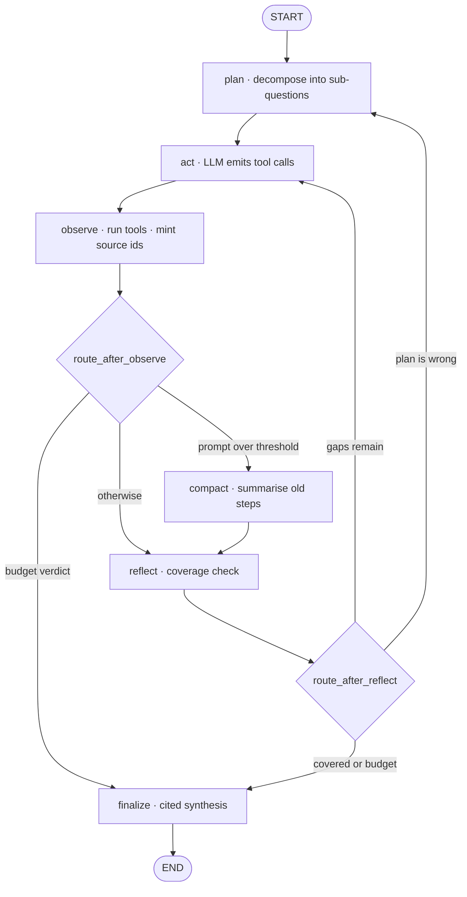

# Tool-Using Research Agent

A ReAct agent on an explicit LangGraph state graph: it decomposes a question, calls tools in a loop,
and returns a **cited** answer — with hard budgets on steps, wall clock and dollars, so it can never
run away.

**[Live demo →](https://research-agent-u0ty.onrender.com)** · first load takes ~60s, free-tier cold start

<!-- DEMO GIF GOES HERE -->

Budgets are the feature, not a safety net bolted on afterwards. When one trips, the run returns a
partial answer with whatever it did establish — never an error, never nothing.

---

## Measured results

30 cases × 3 independent runs = **90 trajectories**, agent `gpt-5.4-nano`, judge `gpt-5.6-luna`.
Every per-run trace is committed under [`evals/results/traces/`](evals/results/traces/), so every
number below can be traced back to the run that produced it.

| Metric | Value | 95% CI |
|---|---|---|
| **pass@1** — a single attempt succeeds | **87.8%** | [70–95%] |
| **pass^3** — *all three* attempts succeed | **76.7%** | [59–88%] |
| Tool recall | 100.0% | — |
| Tool precision | **40.4%** | — |
| Citation resolution (cited ids that exist) | 97.7% | — |
| Invented-URL rate | 0.0% | — |
| Cost per run | $0.0024 | p95 $0.0060 |
| Latency | 16.6s p50 | 79.7s p95 |

Full breakdown, per-tier results and failure modes: **[evals/REPORT.md](evals/REPORT.md)**.

**Honest readout.** The headline is not the interesting number. Tool recall is 100% and precision is
40.4%: the agent finds everything it needs and then keeps going, making **3.3× more calls than the
cases expect**, with 11 of 90 runs hitting a per-tool call cap rather than deciding they were
finished. The `reflect` node exists to catch premature *stopping*, and this agent has the opposite
problem — it overruled a proposed stop 35 times across 90 runs, which on this evidence is often
pushing it to search when it could already answer. A single pass-rate would have hidden all of that.
Reporting precision and recall side by side is what makes it visible.

`pass^3` is 76.7% against a pass@1 of 87.8%, and the gap between `pass^3` and `(pass@1)^3` is
**+0.090**. Because x^k is convex, that quantity is non-negative whenever per-case rates differ at
all, so a positive value means failures are **concentrated in a fixed set of cases** rather than
scattered randomly across runs. Those are specific hard cases to go and fix, not variance to average
away.

---

## What it does

1. **plan** — decomposes the question into 1–5 searchable sub-questions.
2. **act** — the model picks tools. Tools that have hit their per-run cap are withdrawn from the
   schema rather than offered and refused.
3. **observe** — runs the calls in a thread pool, mints citable source ids, truncates observations,
   and counts consecutive failures for a circuit breaker.
4. **compact** — folds older steps into a rolling summary when the prompt grows past a threshold.
5. **reflect** — checks coverage against the sub-question list and decides continue / replan / finish.
6. **finalize** — synthesises a cited answer, or assembles one from state without an LLM if the
   budget is gone.

Tools: `web_search` (Tavily, with a circuit-broken `ddgs` fallback), `fetch_page`, `calculator`,
`code_execution` (sandboxed), `file_ops` (workspace-confined).

## Architecture



This diagram is generated by `research_agent.graph.mermaid()` from the same constants the graph is
wired from, so it cannot drift out of sync with the code. A test asserts every node appears in it.

### Design decisions

| Concern | Choice | Why |
|---|---|---|
| Graph construction | Hand-built `StateGraph`, not `create_react_agent` | The control flow *is* the artefact. A prebuilt agent hides both the routing and the eval surface. (`create_react_agent` is also deprecated as of LangGraph 1.0.) |
| Recording *why* a run stopped | One pure `budget_verdict(state, cfg)`, called twice | LangGraph's conditional edges are pure routers — they return a node name and cannot write state, so the edge that decides to bail cannot record the reason. The router calls it to route; `finalize` calls it again to write the reason. Being pure, they agree by construction. |
| Running out of money mid-run | A reserve withheld from the loop | A loop that spent to 100% of the cap would leave `finalize` unable to afford its own call and return nothing — the opposite of graceful degradation. |
| Losing citations to compaction | Sources live in state, not in message text | Compaction rewrites the scratchpad; the citation registry is a different key. No summariser mistake can reach it. A test proves this by feeding in a summary that names no sources at all. |
| Message format | Raw OpenAI dicts with `operator.add`, not `add_messages` | `llm.py` speaks the wire format directly, so `add_messages` would coerce dicts into objects that every call converts back. Its one real feature — ID-based dedup — is unused here. |
| Parallel tool calls | A thread pool *inside* `observe` | Parallel graph branches writing the same reducer-less key in one super-step raise `InvalidUpdateError`, and each branch burns a super-step against the recursion limit. |
| API surface | Responses, not Chat Completions | Measured, not assumed: Chat Completions returns a 400 for `tools` + `reasoning_effort` on both `gpt-5.4-nano` and `-mini`. Responses handles it. |

---

## Evaluation

Most agent repos ship a loop and a screenshot. The eval is the part this project is actually about,
so it is hand-rolled rather than delegated: `agentevals` has had no release in a year, Ragas changed
GitHub orgs and is deprecating its own `ToolCallAccuracy`, and OpenAI's hosted Evals platform shuts
down in November 2026. A few hundred owned lines outlive all three, and the metric definitions stay
legible instead of living behind someone else's `.evaluate()`.

**One rule governs the dataset**, enforced by the loader: every case carries at least one
deterministic anchor — a string that must (or must not) appear in a correct answer. If a correct
answer cannot be pinned that way, the case is unscoreable and the judge ends up measuring its own
taste. Cases that cannot meet that bar are cut.

**Tool-call accuracy** uses maximum bipartite matching between expected and actual calls, not greedy
left-to-right — greedy lets one actual call satisfy two expectations, inflating recall on exactly the
runs where the agent was lazy. Arguments are compared field by field with per-field semantics (seven
matchers: exact, contains_any/all, regex, numeric_close, lte/gte, any), not by serialising both sides
and comparing strings. All three degenerate cases are defined explicitly, because undefined edge
cases are where harnesses quietly return flattering numbers:

| Expected | Actual | P / R / F1 |
|---|---|---|
| 0 | 0 | 1.0 / 1.0 / 1.0 — correctly declined to use a tool |
| 0 | >0 | 0.0 / 1.0 / 0.0 |
| >0 | 0 | 1.0 / 0.0 / 0.0 |

**Ordering** is scored by longest common subsequence rather than Kendall tau, so an agent that got
the spine right and inserted an extra hop gets partial credit; Kendall penalises every inversion
equally and cannot tell those apart. **Forbidden-tool calls are reported separately from F1** — waste
and safety are not capability. **Citation resolution and invented-URL rate** are the cheapest
hallucination checks here and the only ones that catch a confident answer citing a source that does
not exist.

**The judge** is binary with an anchored rubric and four worked examples, sampled at temperature 1.0
rather than 0 — three samples at 0 are identical roughly 95% of the time, which is cargo-culted
self-consistency rather than measurement. Unparseable judgements are excluded and counted, never
coerced to INCORRECT, since coercion biases the result in whichever direction it goes.

Every rate carries a **95% Wilson interval**. At n=30 the normal approximation runs outside [0,1] and
is simply wrong, and a rate without an interval at this sample size is the first thing worth
questioning.

`make report` regenerates [evals/REPORT.md](evals/REPORT.md) from the committed results, and CI runs
it followed by `git diff --exit-code` — which proves mechanically that every number here comes from a
committed artefact rather than from something typed once by hand.

---

## Quickstart

```bash
git clone https://github.com/vireshkoli/Research-Agent-Langgraph.git
cd Research-Agent-Langgraph

uv sync --dev
cp .env.example .env          # add OPENAI_API_KEY; TAVILY_API_KEY is optional
make check                    # ruff + mypy + 263 tests, no API key needed

uv run python -m research_agent "Who won the 2024 Nobel Prize in Physics, and why?"
```

Watch a budget trip and still get an answer:

```bash
uv run python -m research_agent --max-steps 1 "Compare the largest Llama 3 and Mistral models"
# → partial cited answer, early_exit_reason: max_steps, exit code 0
```

Other entry points:

```bash
make eval-dry                 # validates all 30 eval cases, spends $0
make report                   # regenerates evals/REPORT.md from committed results
docker compose up demo        # the deployed container, on localhost:7860
uv run python -m research_agent.tools --demo   # exercise every tool once
```

---

## Known limitations

Written before anyone asks.

- **The agent over-searches.** 40.4% tool precision against 100% recall; 3.3× more calls than
  expected; 11 of 90 runs hit a tool cap instead of stopping. This is the clearest thing to fix next,
  and the most likely culprit is `reflect` being biased toward "continue".
- **The judge is not yet validated against a human.** Until `evals/human_labels.json` is populated
  and Cohen's κ is reported, every judge-derived number above should be read as unvalidated —
  `REPORT.md` says so in place of the agreement section.
- **Self-preference is not controlled.** Judge and agent are both OpenAI models. They are different
  *generations*, not different *families*; ruling this out needs a judge from another provider.
- **n=30 is small.** Every interval above is wide. Differences under ~15 points are not
  distinguishable from noise.
- **Prompt caching does not engage.** Measured 6.6% cache hit rate. The stable prefix (system prompt
  plus question) is around 270 tokens, below OpenAI's 1024-token minimum for caching. An earlier cost
  model here assumed ~58% and was wrong; runs came in cheaper than budgeted anyway, for unrelated
  reasons.
- **`code_execution` is a resource guardrail, not a security boundary**, and its docstring says so at
  length. Real isolation (network namespaces, bubblewrap, gVisor) needs `CAP_SYS_ADMIN`, which
  unprivileged container hosts do not grant. What it does provide is a scrubbed environment — the
  child process never sees an API key — plus an import allowlist, self-imposed resource limits and a
  process-group kill. Do not point it at anything whose compromise would matter.
- **Two of my own eval cases were wrong**, and both were caught before publication. One scored a
  correct refusal as a failure because a substring anchor cannot distinguish quoting a prompt-injection
  payload from obeying it. The other asked how long before the Web went public *Snow Crash* was
  released, marking the agent wrong for answering 1993 (CERN's public-domain release) against a
  reference asserting 1991 — both defensible. That case was rewritten and re-run rather than having
  its rubric loosened after the fact; the substitution is recorded in `evals/results/full.json`.
- **Re-running produces different numbers.** The agent is non-deterministic and the web moves under
  it. The committed traces are the evidence, not a reproducibility promise.

## What I'd do next

1. **Fix the over-searching.** Feed `reflect` the marginal value of the last search — if two
   consecutive steps added no new sources, bias hard toward finishing.
2. **Validate the judge**, then re-run with κ reported and the agreement caveat removed.
3. **A cross-family judge** (Claude or Gemini) to bound self-preference rather than disclaiming it.
4. **Grow the dataset to ~100 cases.** The interval width at n=30 is the binding constraint on saying
   anything is better than anything else.
5. **Make search results cheaper to read.** A rerank-and-truncate pass over search snippets before
   they enter the prompt would cut input tokens materially at these step counts.

---

## Repository layout

```
src/research_agent/
  llm.py         the single OpenAI wrapper: pricing, cost tracking, four spend guards
  graph.py       StateGraph wiring, both routers, the mermaid diagram
  budget.py      budget_verdict() — the pure function the routers and finalize share
  state.py       ResearchState + the reducers, each with its reasoning
  nodes/         plan, act, observe, compact, reflect, finalize
  tools/         registry + web_search, fetch_page, calculator, code_exec, file_ops
  trace.py       the canonical per-run trace schema
  demo_guard.py  daily spend cap, BYO-key, input limits for the public demo
evals/
  dataset.json   30 cases: 12 easy, 11 multi-hop, 7 adversarial
  metrics.py     bipartite matching, P/R/F1, LCS ordering, pass@1 / pass^k, Wilson CIs
  judge.py       binary rubric with worked examples
  agreement.py   Cohen's κ, Gwet's AC1, bootstrap CI, confusion matrix
  results/       committed traces and results — the audit trail behind every number
tests/           263 tests, no API key required
```

## Licence

MIT — see [LICENSE](LICENSE).
